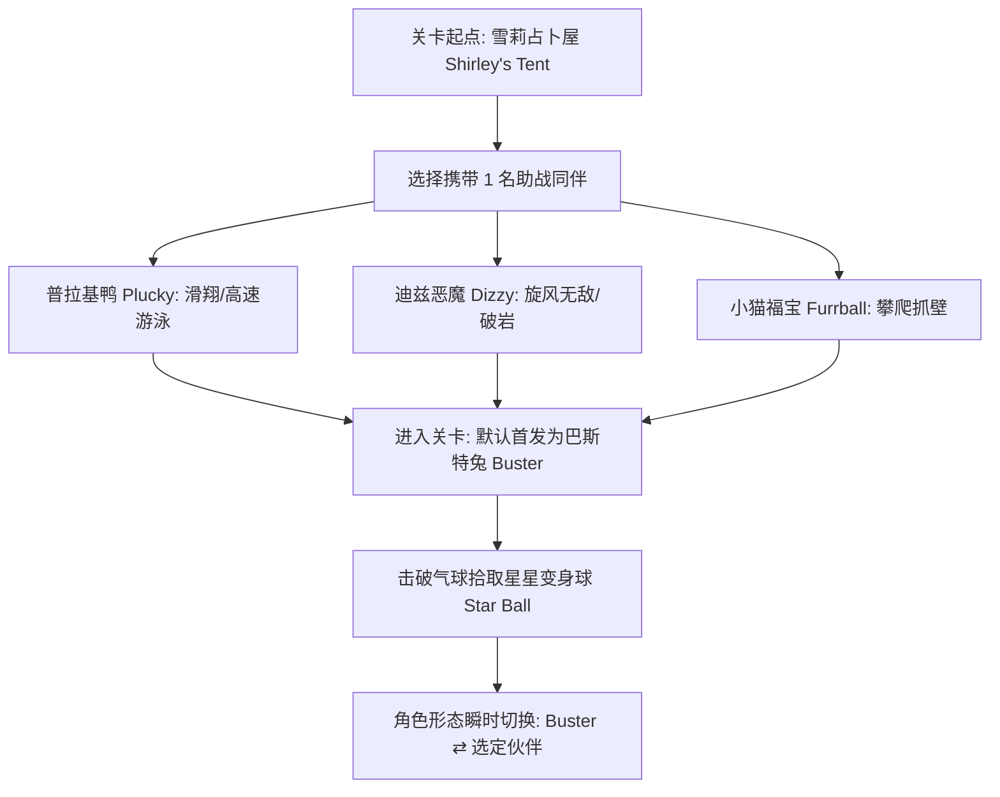
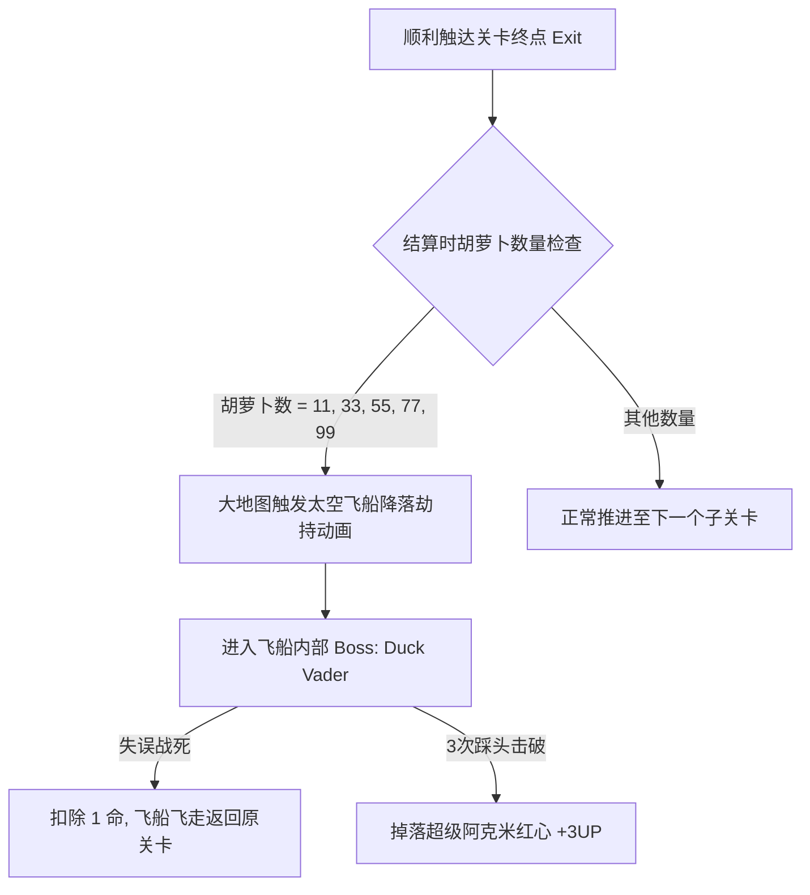
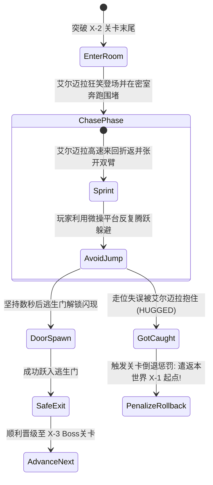

# 《兔宝宝大冒险》（Tiny Toon Adventures）全维度游戏设计深度拆解与全要素档案

> 📌 **文档定位**：本文档为 1991 年任天堂 FC（Famicom / NES）平台经典动作平台游戏（ACT）《兔宝宝大冒险》（Tiny Toon Adventures）的工业级游戏设计分析与全要素百科（GDD/Analysis）。涵盖历史背景、角色异构设计、底层物理与伤害判定、全关卡架构、隐藏机制（Duck Vader/Elmyra）、音画技术实现以及关卡设计方法论拆解。

---

## 一、 游戏基础信息与历史背景

### 1. 基础档案表

| 项目参数 | 规格指标 / 内容详情 | 备注说明 |
| :--- | :--- | :--- |
| **游戏原名** | Tiny Toon Adventures（タイニー・トゥーン アventures） | 华纳兄弟官方授权企划 |
| **中文常用译名** | 兔宝宝大冒险 / 兔宝宝历险记 / 宾尼兔 / 迷你乐一通 | 国内黄卡时代经典译名 |
| **开发与发行商** | KONAMI（日本科乐美） | 科乐美全盛期白金制作水准 |
| **发布平台与介质** | Nintendo Famicom / NES (8-bit) 卡带 | 使用 Konami 专有芯片（VRC4/MMC3类） |
| **发行时间** | 1991年12月（北美） / 1991年12月20日（日本） / 1992年4月（欧洲） | FC 晚期成熟工业化代表作 |
| **游戏类型** | 2D 平台动作横版过关（Platformer ACT） | 融合角色切换与箱庭探索 |
| **制作核心团队** | 总监：山下和之（Kazuyuki Yamashita） 主程序：柴田裕司（Yūji Shibata） 作曲：船桥纯、中岛正惠、宫胁聪子 | 著名“矩形波俱乐部”（Kukeiha Club）音效配乐 |
| **IP 衍生背景** | 华纳兄弟动画部与斯皮尔伯格（Steven Spielberg）联手监制的同名电视动画《Tiny Toon Adventures》（1990） | 《Looney Tunes》（乐一通）的新生代学园传承版 |

### 2. 世界观与故事主线（Narrative Arc）
- **舞台设定**：阿克米庄园（Acme Acres）与周遭奇异领域。
- **危机起因**：阿克米学院的纨绔恶少**蒙大拿·麦克斯（Montana Max）**绑架了**芭丝兔（Babs Bunny）**，将其囚禁在戒备森严的奢华机械城堡中，扬言要将其沉入水族池喂鲨鱼。
- **主角动机**：**巴斯特兔（Buster Bunny）**召集好友们踏上营救之路，必须横跨平原、海盗船、原始古树、荒废都市与神秘的“达达主义”疯狂之地，搜集开启城堡大门的 5 把金钥匙，击破麦克斯的机械堡垒救出芭丝。

---

## 二、 核心操作与异构角色系统（Playable Characters & Abilities）

游戏开创性地采用了**双角色即时切换机制**：关卡前在雪莉占卜屋中选定 1 位搭档，关卡中拾取“星星变身球（Star Ball）”即可在巴斯特兔与搭档之间无缝形态切换。

### 1. 角色能力横向对比矩阵

| 角色名称 | 动画原型关系 | 核心特异功能（B键 / 动作） | 移动与跳跃性能 | 战术适用场景 | 缺陷与反制惩罚 |
| :--- | :--- | :--- | :--- | :--- | :--- |
| 🐰 **巴斯特兔** *(Buster Bunny)* | 宾尼兔（Bugs Bunny）的门徒 | **高速滑铲（Dash Slide）**： 奔跑中按「下」发动，钻入单格矮道并冲撞敌人 | 基础移动极速最高，普通起跳高度位列全员之冠 | 高难度长跨度跳跃平台、隐藏地道探索、常规跑图 | 无对空或大范围判定技能，极其依赖走位 |
| 🦆 **普拉基鸭** *(Plucky Duck)* | 达菲鸭（Daffy Duck）的门徒 | **空中拍翅滑翔（Flutter Glide）**： 空中间歇连点跳跃键； **卓越水下机动（Aquatic Master）** | 水面浮力无视，在水中拥有 8 方向无惯性灵活穿梭能力 | 湿地大沼泽（World 2）、超长无立足点深渊坑洞 | 陆地起跳高度略逊于兔宝宝；滑翔速率较慢，易成空中活靶 |
| 🌪️ **迪兹恶魔** *(Dizzy Devil)* *(注：原案常被误称为大狗哈姆顿)* | 塔斯马尼亚恶魔（Taz）的门徒 | **狂暴龙卷旋风（Tornado Spin）**： 按B键化为旋风，全方位无敌判定，瞬杀荆棘怪与坚硬障碍 | 正常行走速度较慢，跳跃手感偏沉重 | 密集重型怪群、需清理可破坏碎石砖块的封闭密道 | **眩晕硬直（Dizzy Cooldown）**：旋风结束后出现约 1.5 秒摇晃硬直，期间完全无法防守防御 |
| 🐱 **小猫福宝** *(Furrball)* | 傻大猫（Sylvester）的门徒 | **利爪攀附（Wall Cling & Climb）**： 贴近垂直墙面按跳跃/方向键向上连续翻爬，或缓慢贴壁滑降 | 垂直纵深移动王者，平地跑步与跳跃表现中规中矩 | 原始古树（World 3）、高层烟囱、跳跃平台断层区 | 无法应对贴墙生成的针刺陷阱，抓墙判定需要精准摇杆输入 |

> ⚠️ **核心更正说明**：
> 在原作动画与游戏中，**哈姆顿（Hamton J. Pig）**是一只粉色小猪（对应猪小弟 Porky Pig），他是关卡内开设“萝卜兑换商店”的 NPC，并非可操作角色！旋风攻击的技能持有者是紫色的**旋风大嘴怪/迪兹恶魔（Dizzy Devil）**。

---

## 三、 底层数值、生命循环与物理引擎规则

### 1. 严苛的“一击毙命”与红心护盾系统
《兔宝宝大冒险》被誉为硬核难度的根本原因在于其底层的“0/1”容错设计：

- **基准状态（One-Hit Death）**：在无附加状态下，角色受到任何敌人实体碰撞、子弹射击或场景陷阱（尖刺、落石）判定，**直接损失 1 条生命（Lost Life）**。
- **红心护盾（Heart Shield）**：
  - 玩家击破空中的漂浮气球有概率获得红心道具。
  - 持有红心时，角色右上角显示一颗心；受到伤害后抵消一次致死判定，红心破碎，角色获得约 2 秒钟的**无敌闪烁帧（I-Frames）**。
- **红心溢出奖命（Heart Overcap 1UP）**：
  - 若在已经持有红心的满状态下**再次拾取红心**，系统会直接奖励 **+1UP（生命+1）**。
  - 最大生命上限固定为 **9 命**。
- **阿克米超级红心（Acme Big Heart）**：
  - 仅在隐藏宇宙关卡击破 Duck Vader 后作为特殊奖励掉落，拾取直接 **+3UP**。

### 2. 惯性物理与微操判定
- **冲刺与滑动摩擦力（Inertia & Momentum）**：角色由静止加速到峰值速度需要约 8 帧的加速度过程；反向急停会出现明显的打滑缓冲。
- **线性跳跃高度（Variable Jump Height）**：
  - 轻点 A 键执行“微跳（Hop）”，长按 A 键执行全高度抛物线跳跃。
  - 踩踏敌人头顶的瞬间**持续按住 A 键**，可以获得额外的超级反冲起跳高度（Bounce Jump），是跨越断崖的关键技巧。
- **下段滑铲攻击（Slide Collision Box）**：
  - 滑铲期间，角色垂直碰撞体积（Hitbox）骤降 50%，伤害判定由“受击盒”转换为“攻击盒”，能击穿地表常规爬行敌人。

---

## 四、 经济系统与隐藏机制触发法则

### 1. 基础资源流：胡萝卜（Carrots）与哈姆顿商店
关卡地表及空中分布着胡萝卜，这是全游戏的核心经济循环道具：

- **收集上限**：最高计数为 99 枚，达到 99 后继续拾取不会自动归零重置。
- **哈姆顿神秘小屋（Hamton's Burrow）**：
  - 关卡中某些隐藏暗门内部坐落着小猪哈姆顿的帐篷。
  - 交互规则：消耗 **30 根胡萝卜** 购买 **1 条生命（1UP）**。
  - 当胡萝卜不足 30 时，哈姆顿会挥手拒绝交易。

### 2. 核心隐藏要素：Duck Vader（达斯·鸭魔）太空战触发算法
许多老玩家童年时曾偶然进入过神秘的太空船隐藏关，这一机制在科乐美底层逻辑中有一套极其精密的数学判定：

> 📌 **关键机制确认**：
> 进入隐藏太空关的充要条件是：**通关该子关卡时，身上携带的胡萝卜数必须是 11 的奇数倍（即 11、33、55、77、99）**！
> - 若通关时胡萝卜数为偶数倍（如 22, 44, 66, 88），并不会触发飞船降落；
> - 击败 Duck Vader（恶搞《星球大战》达斯·维达形象的普拉基鸭，手持激光叉发射环形弹幕）后，可收获巨型红心（+3UP）。

---

## 五、 全六大世界架构与关卡机制深度拆解

游戏总共由 6 个主世界构成，前 4 个大关各包含 3 个子关卡（X-1 平台跳跃，X-2 迷宫探索与逃离艾尔迈拉，X-3 区域总力战与 Boss 对决），第 5 关为达达主义解谜关，第 6 关为最终要塞。

### 1. World 1：阿克米绿色丘陵（The Hills / Field of Screams）
- **环境风格**：明媚的绿茵草地、斜坡土丘、地下石窟。
- **子关卡划分**：
  - **1-1**：新手教学关。传授斜坡滑铲、跳跃踩怪、气球爆破与首个伙伴变身球。
  - **1-2**：纵深地下洞窟。尽头为全游戏最著名的**“艾尔迈拉拥抱房间”（Elmyra Encounter）**。
  - **1-3**：基因狂人研究所。
- **关卡 Boss：基因拼接博士（Dr. Gene Splicer）**
  - **攻击逻辑**：踩着滑板在 U 型坡道左右高速折返滑行，折返时向场内投掷具有抛物线重力判定的巨大铁砧（Anvil）。
  - **攻略解法**：站在坡道高位，利用下落落差预判踩其头部 3 次；优先躲避铁砧的二次弹跳判定。

### 2. World 2：无尽沼泽与惊涛海盗船（The Wetlands / Motion Ocean）
- **环境风格**：下沉浮萍草甸、瀑布暗流、水下珊瑚礁、幽灵海盗木船。
- **子关卡划分**：
  - **2-1**：水网交织区。水面分布着大量咬人食人鱼与瞬间下沉的浮木桩。**强烈推荐选用普拉基鸭**。
  - **2-2**：海盗船甲板与缆绳纵横区，末端触发艾尔迈拉遭遇战。
  - **2-3**：海盗船底层货舱，晃动的吊灯与滚落的火药桶。
- **关卡 Boss：海盗铁钩船长（Captain Claw）**
  - **攻击逻辑**：左右穿梭并高举铁钩猛扑，定期投掷滚木酒桶阻碍地面走位。
  - **攻略解法**：保持中距离节奏，在船长抛出酒桶的硬直帧起跳，利用头部踩击连续压制。

### 3. World 3：幽暗密林与古树之巅（The Trees）
- **环境风格**：参天巨树主干、垂直树洞天梯、多层树冠断裂枝丫。
- **子关卡划分**：
  - **3-1**：巨树垂直爬升关。布满大量上下巡逻的树皮啄木鸟与坠落橡果。**福宝猫（Furrball）抓墙攀爬最优解**。
  - **3-2**：高空树梢强风关。风力推拉效应极其明显，终点为艾尔迈拉小木屋。
  - **3-3**：空心树桩内部死斗场。
- **关卡 Boss：凶猛金刚狼（The Wolverine）**
  - **原型考据**：取材自主线经典剧集《Buster and the Wolverine》。
  - **攻击逻辑**：具备极强的跳跃冲撞与利爪撕裂判定，行动轨迹突进迅速。
  - **攻略解法**：利用树桩两侧的小型平台进行高低差诱导，在其突进落地的瞬间从正上方下落踩击。

### 4. World 4：繁华都市与工业废墟（Downtown / Junkyard）
- **环境风格**：水泥街道、漏水消防栓、废弃工地钢铁骨架、巨型液压机。
- **子关卡划分**：
  - **4-1**：街头穿梭。警犬捕狗队、扔铁扳手的流浪鼠。
  - **4-2**：废旧地下工厂管道。蒸汽喷涌机关与粉碎传送带，末端为最后一次艾尔迈拉抓捕房间。
  - **4-3**：废金属堆积场深处。
- **关卡 Boss：恐怖恶猩（Gruesome Gorilla）**
  - **攻击逻辑**：体型庞大，会捶胸引发局部震动硬直，并投掷重型铁桶与滚石。
  - **攻略解法**：借助场景上方悬挂的铁链起跳拉扯视野，抓住其捶胸动作的不可移动时间从头顶踩踏。

### 5. World 5：疯狂之地（Wackyland）—— 机制大转折
- **设计哲学**：致敬达利超现实主义与经典美式无厘头卡通逻辑（Cartoon Nonsense）。全场景为扭曲的几何色块、时钟熔融地面与反重力云层。
- **单关架构**：本世界仅有 1 个关卡（5-1），但为复杂的**非线性空间迷宫**。
- **通关逻辑**：
  - 场景中散布着大量的传送彩门与镜像空间。
  - 玩家的核心任务不是击杀 Boss，而是在迷宫中搜集追寻 **5 只多多鸟（Gogo Dodo）的分身克隆体**。
  - 每抓到一只多多鸟，空间解谜推进一层；集齐 5 只后开启通往麦克斯城堡的跨维度时空之门，并收获第 5 把金钥匙。

### 6. World 6：蒙大拿·麦克斯的黄金堡垒（Montana Max's Mansion）
- **关门大吉的“5钥匙”验证**：
  - 在进入最终堡垒内部前，系统强制检测前 5 个世界中搜集的钥匙总量。若未集齐，安全防爆门将无法打开。
- **顶级关卡杀机：盲跳黑暗机关与防卫管家**：
  - **黑灯瞎火机制**：城堡走廊内出现狡猾的仆从管家，每隔数秒便会拉下电闸总开关，**整个屏幕陷入全黑**，仅留微弱轮廓！玩家必须凭借瞬时记忆在黑暗中盲跳避开尖刺和落穴。
  - **落石与黄金吊灯**：天花板定期坠落水晶吊灯与警卫警棍。
- **最终决战：蒙大拿·麦克斯（Montana Max）**：
  - **场景布局**：麦克斯站在左右两侧的高悬浮雕高台上方，中央是一台不断向上空连续喷吐巨型高压金币的加农炮。
  - **环境武器化机制**：墙体两侧会周期性弹出**巨型弹簧拳击手套（Spring-loaded Boxing Gloves）**。
  - **战术博弈**：
    1. 弹簧拳套既是高伤陷阱，亦是通往高台的“跳板”。玩家必须踏在伸出的拳套或飞升的金币上借力起跳；
    2. 阶段二（伤害两次后）：拳击手套双向交替突刺，延展长度增加，金币喷射速度翻倍；
    3. 累计精准踩中麦克斯头部 3 次后破除其机械装甲，成功解救出芭丝兔，触发通关欢庆大结局。

---

## 六、 心理恐怖机制：艾尔迈拉的拥抱迷宫（The Elmyra Penalty）

在 1-2、2-2、3-2、4-2 关卡末尾，玩家必须进入一个封闭小房间，遭遇病娇动物狂热女童**艾尔迈拉（Elmyra Duff）**。这一机制堪称所有老玩家童年的“噩梦”，也是科乐美教科书级的关卡心理压迫设计：

> ⚠️ **惩罚的严酷性（Psychological Penalty）**：
> 被艾尔迈拉抱住并不会扣除生命条数，但会触发极其致命的**进度彻底倒退（Regression）**——你会被强制遣返回本世界的第 1 个子关卡（如从 4-2 被抓，直接倒退至 4-1）！
> 这种不扣命却剥夺时间与沉没成本的设计，在心理学上产生的挫败感远超单纯的游戏死亡（Game Over），将逃生紧张感拉升至顶峰。

---

## 七、 音乐音效与硬件表现力剖析

科乐美在 FC 平台后期的技术力在本作中得到了淋漓尽致的释放：

### 1. 音乐工程构架（Audio Architecture）
- **制作阵容**：由科乐美顶级作曲部门“矩形波俱乐部”成员船桥纯（Jun Funahashi）、中岛正惠（Masae Nakashima）与宫胁聪子（Satoko Miyawaki）联袂打造。
- **经典主旋律改编**：将布鲁斯·布劳顿（Bruce Broughton）为动画版谱写的奥斯卡/艾美奖级别的交响主题曲，在仅有 5 个声音通道（2个矩形波、1个三角波、1个噪声、1个DPCM采样）的 Ricoh 2A03 芯片上进行了极其惊艳的 Chiptune 8-bit 爵士大乐队（Big Band Swing）还原。
- **音效喜剧感（Slapstick SFX）**：踩怪音效、弹簧起跳波形音、铁砧砸地重音以及艾尔迈拉出场时的小丑笑声，高度贴合美式无厘头滑稽动画风格。

### 2. 图形渲染与动画帧分配
- **大尺寸精灵（Giant Sprites）**：Boss 战角色尺寸均突破 32×32 甚至 48×48 像素，在当时硬件限制下通过交替闪烁机制与扫描线切分保证了极低掉帧率。
- **丰富微表情**：兔宝宝闲置待机时的抖耳朵打哈欠动作、普拉基鸭入水后的滑稽摆尾、迪兹恶魔转圈后的眩晕蚊香眼，赋予了 8 位机角色惊人的生命力。

---

## 八、 经典秘籍指令与速通技术速查（Cheats & Pro Techniques）

### 1. 官方隐藏选关秘籍（Stage Select & Duck Vader Skip）
在游戏标题主画面（Title Screen）下，依次输入：
- `A 键 × 3`
- `B 键 × 3`
- `SELECT 键 × 3`
- 随后**按住 A 键不放，按下 START 键**。

- **效果**：屏幕中央将呼出隐藏选关界面（Stage Select）。
- **选关范围**：可自由选择 Level 1 至 Level 6，亦可直接选择 **Level 24** 瞬间跳入挑战隐藏 Boss Duck Vader 进行 3UP 资源刷取。

### 2. 顶级玩家操作与速通要领（Speedrun Tech）
- **滑铲惯性跳（Slide Jump Momentum）**：在高速滑铲动作未结束的瞬间迅速按下跳跃 A 键，角色会以滑铲的超高初速度弹射升空，用于大幅度跳关跳跃。
- **艾尔迈拉“门神卡位”（Door-Spawn Manipulation）**：在 X-2 艾尔迈拉房间中，门刷新的位置与玩家当前所处的 Y 轴高度及面朝方向相关。高玩可诱导艾尔迈拉在房间最右端起跳，随后反身落地直钻刚刚刷新的木门，实现 3 秒无伤速离。
- **换人帧无敌（Morph Invisibility / Transform Skip）**：碰撞星星球发生形态转换的刹那，角色存在大约 10 帧的逻辑无判定空档，可用于直接贯穿某些挡路的必伤飞行物。

---

## 九、 总结与设计美学评估

《兔宝宝大冒险》绝非普通的 IP 贴皮低幼向作品，而是科乐美平台动作黄金时代的一座里程碑：

1. **外观的欺骗性与硬核精神的交织**：以极度萌趣讨喜的迪士尼/华纳式糖衣画风，包裹着严苛到极致的跳跃判定与死亡惩罚，塑造出独特的反差魅力。
2. **多角色策略的非线性雏形**：在 Metroidvania（类银河恶魔城）尚未完全普及的 8 位机时代，通过 4 名异构角色的能力分工与关卡地形产生强烈的化学反应。
3. **教科书级别的关卡微调节奏**：跳跃、滑铲、水战、攀岩、追逐逃生与纯解谜（Wackyland）交替推进，使得整场游戏自始至终充盈着高密度的刺激与新鲜感。
